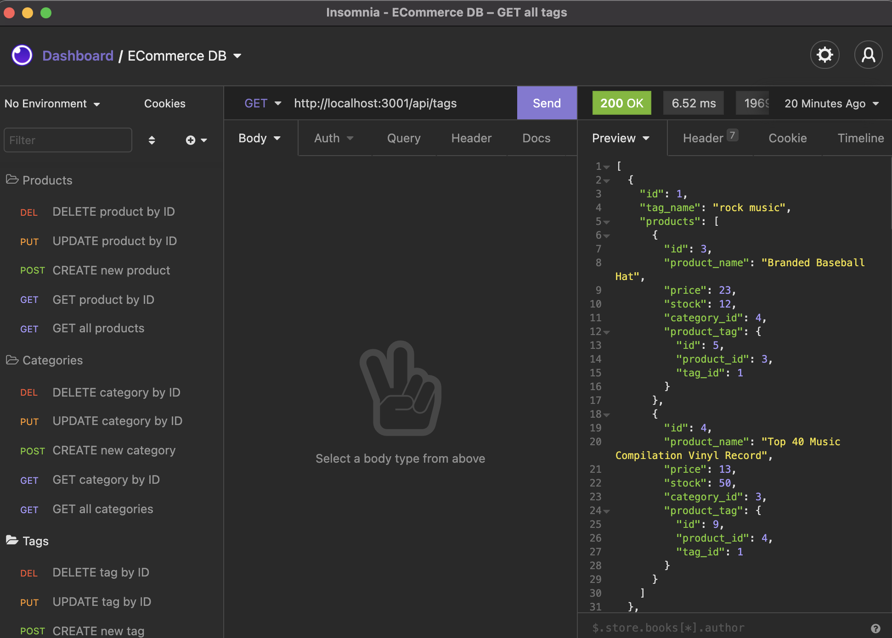

# 13 Object-Relational Mapping (ORM): E-Commerce Back End

## Your Task

This program builds the back end for an e-commerce site by modifying starter code. This program includes Express.js API to use Sequelize to interact with a MySQL database.

## User Story

```md
AS A manager at an internet retail company
I WANT a back end for my e-commerce website that uses the latest technologies
SO THAT my company can compete with other e-commerce companies
```

## Mock-Up

The following screenshot shows the application's GET, POST, PUT, and DELETE routes on all categories, all products, and all tags being tested in Insomnia Core:



## Links

- [Deployed Link](https://github.com/hyanez/NOTE-TAKER)
- [Github Link](https://hyanez.github.io/NOTE-TAKER/)
- [Video Walkthrough](https://watch.screencastify.com/v/OKN0GbFsn8S1Lws6hOlm)
